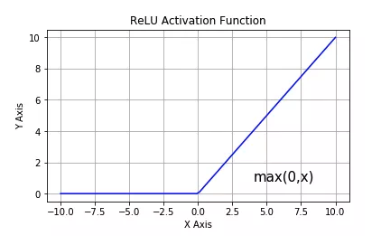
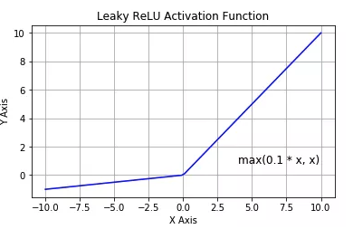
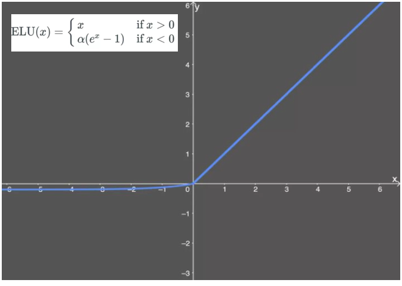

# 激活函数

tensorflow中的激活函数

1. tf.nn.sigmoid
2. tf.nn.softmax
3. tf.nn.tanh,将实数压缩到-1到1之间，输出期望为0。主要缺陷为存在梯度消失问题，计算复杂度高。

    

4. tf.nn.relu：修正线性单元，最流行的激活函数。一般隐藏层使用。主要缺陷是：输出不以0为中心，输入小于0时存在梯度消失问题(死亡relu)

    

5. tf.nn.leaky_relu：对修正线性单元的改进，解决了死亡relu问题。

    

6. tf.nn.elu：指数线性单元。对relu的改进，能够缓解死亡relu问题。

    

7. tf.nn.selu：扩展型指数线性单元。在权重用tf.keras.initializers.lecun_normal初始化前提下能够对神经网络进行自归一化。不可能出现梯度爆炸或者梯度消失问题。需要和Dropout的变种AlphaDropout一起使用。
    
    
    
8. tf.nn.swish：自门控激活函数。谷歌出品，相关研究指出用swish替代relu将获得轻微效果提升。

    

9. gelu：高斯误差线性单元激活函数。在Transformer中表现最好。tf.nn模块尚没有实现该函数。

    

