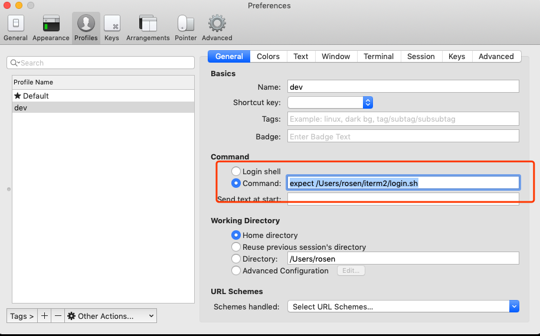

# iterm2登录远程服务器

## expect(弃用)

1. 写个脚本login.sh

   ```shell
   #!/usr/bin/expect
   
   set user <your name>
   set host <your host>
   set password <your password>
   set port <your port>
   
   spawn ssh -p $port $user@$host
   expect "*password:*"
   send "$password\r"
   interact
   expect eof
   ```

2. iterm2新建profile，使用expect执行login.sh

   

3. 点击菜单栏profile，点击dev，登录，美滋滋

## sshpass

由于使用expect，导致无法使用lrzsz，可以用sshpass登录

ssh下载：https://gist.github.com/arunoda/7790979

网上的安装方法都不行，brew都会限制。采用从源码安装的方式。
1. ./configure --prefix=/path/to/install_path
2. make install

在iterm2的commend填入：

`sshpass -p [password] ssh -p port user@addr`


   