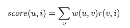

# 协同过滤（Collaborative Filtering）

## User-base CF

每个user一个向量，每一维是用户对某个商品的评分，计算用户与用户之间的相似度，给用户推荐相似用户喜欢的商品，推荐商品的权重可以使用如下方式计算：
$$
score(u,i) = \sum_{v} w(u,v)r(v,i)
$$

其中`w(u,v)`表示用户u和用户v之间的相似度，`r(v,i)`表示用户`v`对物品`i`的打分。

## Item-base CF

每个商品是一个向量，每一维是一个用户对该商品的评分，计算商品与商品之间的相似度，给用户推荐喜欢商品的相似商品。

## 问题

- CF方法无法处理冷启动问题
- user-base方法倾向推荐热门商品（多数用户喜欢），item-base方法擅长推荐长尾商品。但是item-base在碰到热门商品时也会又问题，假设使用jaccard系数，热门商品的分母会很大，导致最终的相似度没有区分性。
- user-base的方法前提假设是用户会喜欢那些与他有共同爱好的人喜欢的东西，如果与该用户有相同喜好的人不多，效果不理想
- item-base假设用户会喜欢和他以前喜欢的东西相似的东西，具体视用户而定。可以通过计算喜欢商品的自相似度来做判断。

## 相似度计算方法

1. Jaccard系数
2. 皮尔逊相关系数
3. 欧几里得距离
4. 余弦相似度

参考：

https://www.cnblogs.com/ECJTUACM-873284962/p/8729010.html