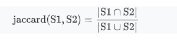

# minhash

jaccard系数是一种计算集合相似度的方式，协同过滤中会用到。但是，不管是user-base，还是item-base，当user或item特别多的时候，计算集合的交集代价很高，minhash是一种近似方法。

从概率的角度解释，jaccard系数等于从S1和S2并集元素中选出交集元素的概率，minhash其实是近似这个过程，具体做法是:

1. 维护一个计数count
2. 选择一种hash方法f
3. 将S1和S2中的每个元素用f哈希
4. 如果min(Hash(S1)) = min(Hash(S2))，则count=count+1
5. 重复2~4的过程N次
6. 则jaccard系数近似等于count/N

解释：

1. 如果两个数相同，则hash值一样
2. min(Hash(S1)) = min(Hash(S2))=S1和S2中的最小值
3. 因为随机，S1和S2中每个数成为S1与S2并集中最小的数的概率一样
4. 那么选中S1交S2中的值作为最小值的就是jaccard(S1,S2)系数