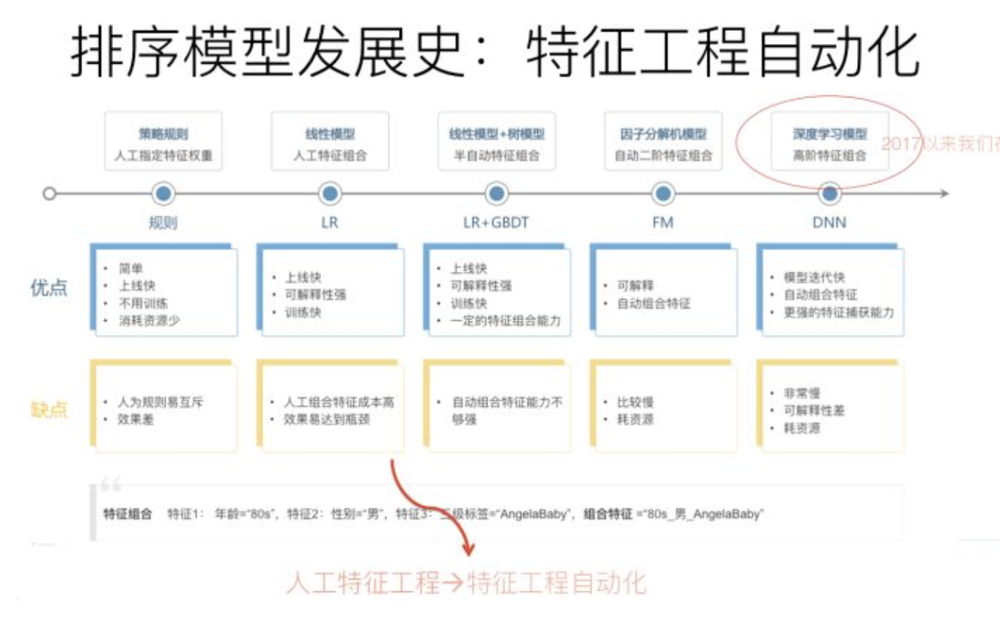

# 张俊林推荐模型演进阅读

文章链接：https://zhuanlan.zhihu.com/p/100019681

## 召回

1. 召回可以分为个性化召回和非个性化召回。非个性化召回比如热门商品召回，高点击商品召回等。个性化召回如个性化标签召回。可以把个性化召回看做是单个特征的模型。协同过滤可以看做是User_id，Item_id两个特征的模型。**从排序角度看待推荐系统**。
2. 推荐系统包含：召回、粗排、精排、重排。粗排模型简单、高效，精排模型复杂、准确。重排包含一些业务策略，如去重、多样性控制等。
3. 召回从单特征会向多特征发展：向量化召回
4. 原来多路召回每一路可以靠硬截断控制多样性，向量化召回存在偏向头部商品的问题
5. 可以对用户行为序列进行建模，将用户行为序列拆解成多个兴趣点，生成多个embedding，可以缓解头部问题
6. 用户行为序列多兴趣点embedding不适合用在排序截断，因为可以用attention代替。但是如果行为序列太长，可考虑将兴趣点聚类再attention
7. 对于传统观点的召回来说，精准并不是最重要的目标，找出和用户兴趣有一定程度相关性但是又具备泛化性能的物品是召回侧的重点
8. 召回的另一个技术趋势是融入知识图谱，有两种融合方式：实体路径embedding和meta-path。embedding效果好但是可解释性差，meta-path效果差但是可解释性强。
9. 知识图谱不适合排序阶段，因为引入知识图谱很可能会引入噪声
10. 图神经网络可用于召回阶段，图中可以容纳各种异质信息，包括用户、商品、商品属性等等。适合做冷启动。

## 排序

排序发展史

排序技术目前发展趋势

1. 使用模型显示得组合高阶特征：DeepFM，Deep& Cross、XDeepFM。这个方向空间有限，因为有证据表明二阶特征确实有效，但是三阶及更高阶特征效果可能有限，甚至引入高阶特征会带来负面作用。
2. 目前推荐领域主要的特征提取抽取器是MLP，但是MLP抽取特征效率比较低。图像领域的CNN不适合推荐这种纯特征场景，NLP领域的RNN可以处理用户行为序列但是不能并行，比较慢。NLP领域兴起的Transformer比较适合推荐，里面multi-head attention可以很好处理特征之间的关系。但是实际上，Transformer并没有取得比MLP更好的效果，可能需要对其结构进行改造。
3. AutoML用户探索探索模型结构是个必然
4. 多目标优化在推荐领域是很值得尝试的一个领域。可以用多个模型训练多个目标，然后通过权重或者简单模型进行融合(share-nothing结构)。或者多个目标的模型共享底层参数(share-bottom)。
5. 在排序和召回中都可以尝试使用多模态信息，排序阶段可以将图片信息当做特征，召回阶段可以新增图片召回分支

延伸阅读

| 文章                                                         | 说明                      | 是否阅读 |
| ------------------------------------------------------------ | ------------------------- | -------- |
| https://zhuanlan.zhihu.com/p/58160982                        | FM                        |          |
| Sampling-Bias-Corrected Neural Modeling for Large Corpus Item Recommendations | DNN双塔                   |          |
| Recurrent Neural Networks with Top-k Gains for Session-based Recommendations | 用户行为序列建模，GRU     |          |
| Personalized Top-N Sequential Recommendation via Convolutional Sequence Embedding | 用户行为序列建模，CNN     |          |
| Self-Attentive Sequential Recommendation                     | Transformer               |          |
| Multi-Interest Network with Dynamic Routing for Recommendation at Tmall | 用户行为序列多兴趣点-召回 |          |
| Practice on Long Sequential User Behavior Modeling for Click-Through Rate Prediction | 用户行为序列多兴趣点-排序 |          |
| Knowledge Graph Attention Network for Recommendation         | 知识图谱推荐              |          |
| RippleNet: Propagating User Preferences on the Knowledge Graph for Recommender Systems | 知识图谱推荐              |          |
| Inductive Representation Learning on Large Graphs            | 图神经网络                |          |
| Graph Convolutional Neural Networks for Web-Scale Recommender Systems | 图神经网络                |          |
| Deep & Cross Network for Ad Click Predictions                | DCN                       |          |
| Combining Explicit and Implicit Feature Interactions for Recommender Systems | XDeepFM                   |          |
| Automatic Feature Interaction Learning via Self-Attentive Neural Networks | 特征抽取                  |          |
| An End-to-End Wide & Deep Learning Framework for CTR Prediction | DeepFM                    |          |
| Combining Feature Importance and Bilinear feature Interaction for Click-Through Rate Prediction | AutoML                    |          |
| Top-K Off-Policy Correction for a REINFORCE Recommender System | 增强学习                  |          |
| Reinforcement Learning for Slate-based Recommender Systems: A Tractable Decomposition and Practical Methodology | 增强学习                  |          |
| Modeling Task Relationships in Multi-task Learning with Multi-gate Mixture-of-Experts | 多目标优化                |          |
| A Pareto-Efficient Algorithm for Multiple Objective Optimization in E-Commerce Recommendation | 多目标优化                |          |
| Collaborative Multi-modal deep learning for the personalized product retrieval in Facebook Marketplace | 多模态召回                |          |
| Neural News Recommendation with Long- and Short-term User Representations | 用户长短兴趣建模          |          |
| image Matters: Visually modeling user behaviors using Advanced Model Server | 多模态排序                |          |
| Sequence-Aware Recommendation with Long-Term and Short-Term Attention Memory Networks | 用户长短兴趣建模          |          |
| Personalized Re-ranking for Recommendation                   | 重排                      |          |
| Learning a Deep Listwise Context Model for Ranking Refinement | 重排                      |          |
|                                                              |                           |          |
|                                                              |                           |          |
|                                                              |                           |          |

