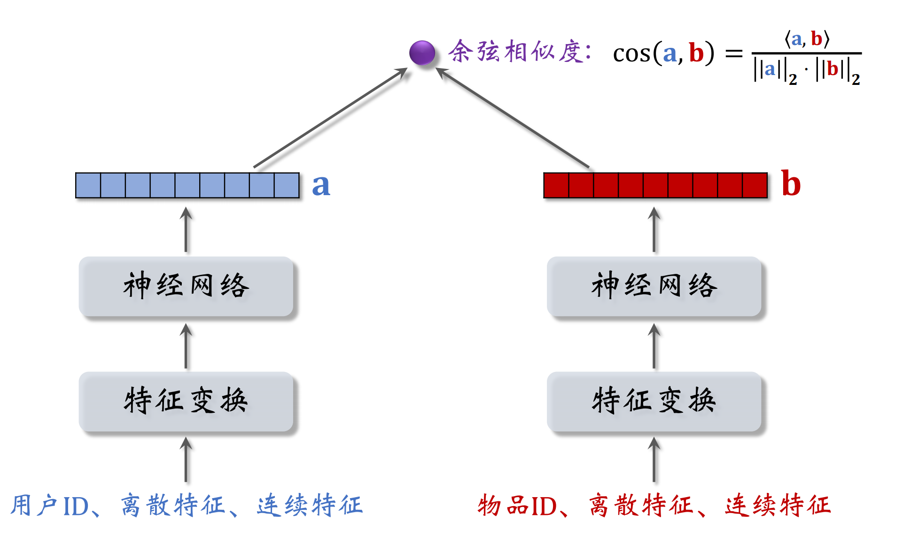
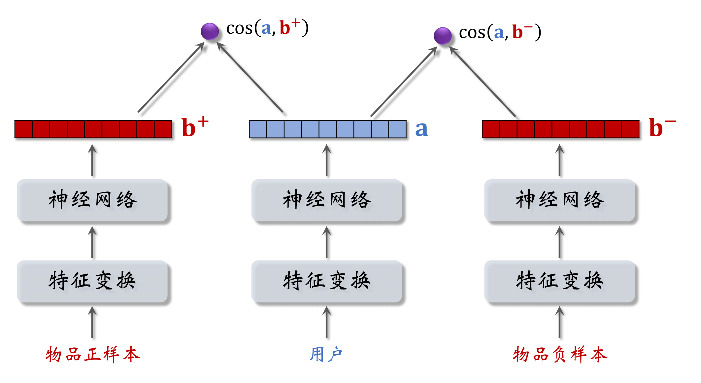
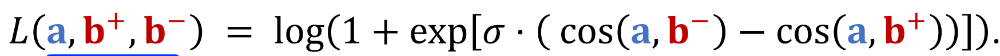
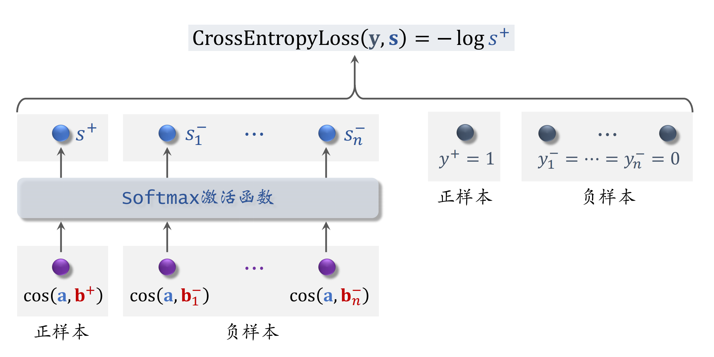
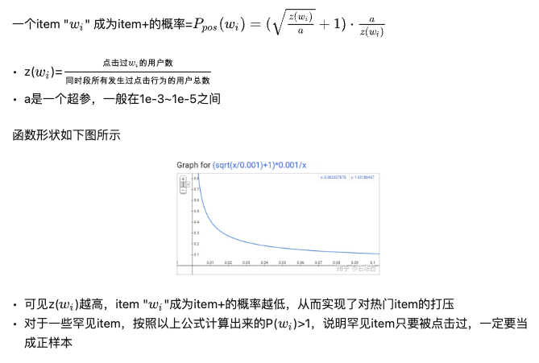
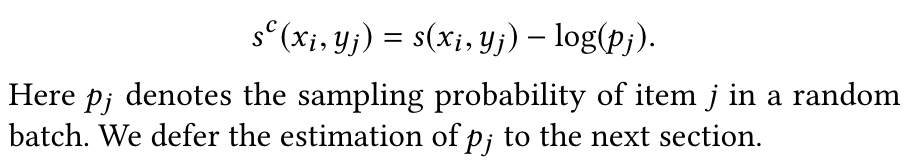

# DSSM

## 模型结构

## 训练方式

### Pointwise训练

看做二分类任务，对于正样本鼓励$cos(a,b)$接近1，对于负样本鼓励$cos(a,b)$接近0，正负样本比例控制在1:2或者1:3（经验）。采用sigmoid函数讲cos转换成概率，因为cos有值域限制，可以进行放缩。使用交叉熵损失函数。

$$
p = \sigma(\gamma cos(a,b))
$$

### Pairwise训练

构造<用户，正样本，负样本>三元组样本

采用Triplet hinge loss，参考[RankLoss笔记](../../机器学习/0003-RankLoss.md)

也可以采用Triplet logistic loss, 其中$\sigma$是大于0的超参数

### Listwise训练

构造<用户，正样本，n个负样本>训练样本

## 样本构造

### 正样本

采用曝光有点击作为正样本。因为热门商品更容易被曝光和点击，成为正样本的概率更大，会造成头部效应。可以对正样本进行欠采样，对负样本过采样。正样本抛弃概率与点击次数正相关。

如

参考：[知乎](https://www.zhihu.com/question/426543628/answer/1631702878?utm_source=zhihu&utm_medium=social&utm_oi=733021284388048896)

### 负样本

简单样本(没被召回的样本)：
1. 全局负采样：采样概率与$clk^{p}$正相关，p<0，经验值可以取p=0.75。如$p_i = \frac{clk_i^{0.75}}{\sum(clk_i^{0.75})}$
2. Batch内采样：因为batch内的都是正样本，抽样概率与$clk$正相关，对热门商品打压力度太大，需要进行修正。google的做法是训练时对logits进行修正，infer是不修正。

参考论文：Sampling-Bias-Corrected Neural Modeling for Large Corpus Item Recommendations

困难样本：
1. 粗排过滤的样本
2. 精排过滤的样本

错误样本：
1. 曝光未点击的样本。召回模型的目标是找到用户感兴趣的Item，而不是找更感兴趣的Item。用户没有点击不代表用户不感兴趣，可能只是用户对其他的更感兴趣。

## 线上服务

1. 用户塔用来做线上推到，物品embedding提前算好。用户向量不提前算好，是因为可以线上实时捕获用户的最新行为。
2. 每天凌晨全量更新，用前一天的的数据随机shuffle（比从早到晚顺序训练好）之后在前一天全量模型的基础上重新训练(1 epoch)。
3. 每小时增量更新，只更新用户ID Embedding，其他不更新。
4. 不能用增量更新完全代替全量更新，因为小时级数据有偏(中午和早上不一样)，模型波动较大。

