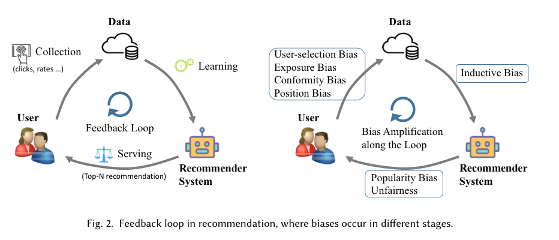
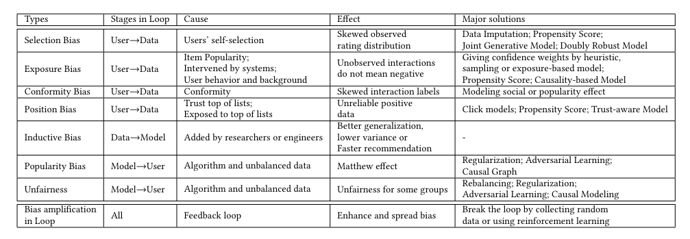
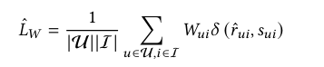
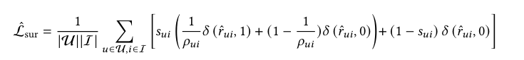
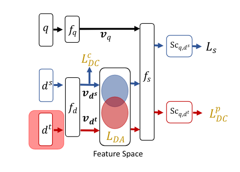
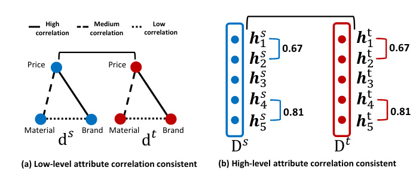
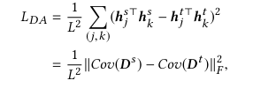
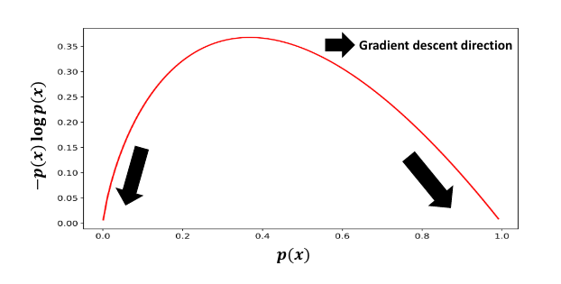
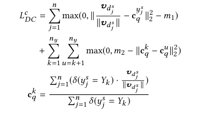

# Exposure Bias

## 推荐系统中的Bias

可以将推荐系统看成User-Data-System三个部分，每个部分在做数据交换的时候都会存在bias，如下图所示。

- Selection Bias: 用户选择交互的item不是随机的，更喜欢选自己喜欢的进行交互
- Exposure Bias: 系统中只有少部分item曝光给了用户
- Conformity Bias: 用户喜欢从众，比如豆瓣打分，用户更倾向于与其他人打分差不多
- Position Bias: 用户偏向于与位置靠前的item进行交互
- Inductive Bias: 为了让目标函数拟合得更好或更具有泛化性，对模型做出的一些假设
- Popularity Bias: 越热门的item会变得更热门
- Unfairness: 年龄、性别、财富等歧视

解决思路：

## Exposure Bias

曝光偏差本质上是一个 training 和 serving 不一致的问题。这个问题往往是由于具体业务场景的限制，导致 training data 中的样本只是其 serving 时的很小一部分，因为其他的样本没被曝光/点击，导致了无法得到其 label。

有几种解决思路：
1. Data Augmentation
2. Propensity Score
3. Transfer learning

### Data Augmentation

这种方法即把没有曝光的数据想办法用上，给所有样本一个权重。下式中$s_{ui}$表示样本是否被观察到，$r_{ui}$表示label

这种权重有几种方式设定：
1. 启发式的，如如果样本被观察到，权重设为1，没有被观察到，权重大小与用户活跃度、或item活跃度、或用户和item特征重合度有关。
2. 采样：不同样本的采样概率视为权重
3. 曝光模型，将item是否曝光用模型建模，权重视为曝光概率

### Propensity Score

根据曝光倾向性对损失函数进行纠偏，使得最终的经验误差是真实误差的无偏估计。

### Transfer learning

观测到的数据被当做 source domain，全量数据被当做 target domain，利用 domain adaption 将source domain的知识迁移到target domain。代表作是阿里2020年发表的[ESAM](https://arxiv.org/pdf/2005.10545.pdf)。

ESAM设计了$L_{DA}$损失函数学习特征之间的相关性，基于两个假设：
1. 特征相关性在source domain 和 target domain都是一致的
2. 原始的特征(即 price、brand、material)会被映射到 embedding 中某一维或几维

基于此设计了，假设有n个特征，映射到embedding之后是L维，在L维之间做协方差，$h$是长度为n的向量。

对于无标签样本，设计了损失函数$L^{p}_{DC}$进行自动打标，其实p1和p2是两个阈值，低于p1才认为是负样本，高于p2认为是正样本

由于$-p(x)\log p(x)$如下图所示，模型会让学到的label经可能精准

ESAM损失函数还有另外两个部分，一个是正常的损失$L_s$，另一个是$L^c_{DC}$，$L^c_{DC}$让源域中同类型样本学到的embedding尽可能近，非同类尽可能远。

## 参考资料

1. https://zhizhou-yu.github.io/2020/11/13/Survey-Of-Bias-and-Debias.html
2. https://wulc.me/2021/04/03/Exposure%20Bias%20In%20Machine%20Learning/
3. https://arxiv.org/abs/2010.03240
4. https://www.csie.ntu.edu.tw/~cjlin/papers/occtr/ctr_oc.pdf
5. https://juejin.cn/post/7169387115996774436
6. https://arxiv.org/pdf/2005.10545.pdf