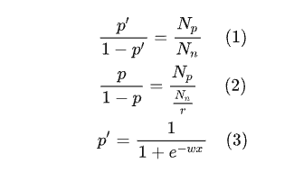

# CTR校准

在做广告ctr预估模型时，虽然使用auc进行模型效果评估，但是预估ctr与实际ctr的偏差也同样重要。因为预估ctr会乘上价格等因素，如果ctr区分度不准确，期望收益其实预估不准确。

比如：两个广告收益分别是5、10，如果预估的点击率分别是5%、2%，实际点击率是4%、3%，其实出第二个广告期望收益更高。

因此需要对ctr进行校准。

## 方法1

符号：
- $p'$采样后预估概率
- $p$未采样预估概率
- $N_{p}$原始正样本数量
- $N_{n}$采样后负样本数量
- $r$表示采样比例
- $\frac{N_p}{r}$表示原始负样本数量

可以得到

最终预测公式：
$$
p = \frac{1}{1+e^{-wx+ln(r)}}
$$

## 方法2

$$
p = \frac{p'}{p'+\frac{1-p'}{r}}
$$

推导结果同方法1

## 参考

1. https://zhuanlan.zhihu.com/p/83982030
