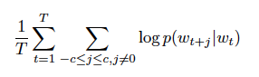
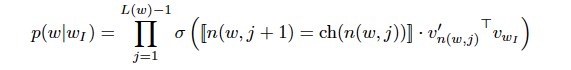
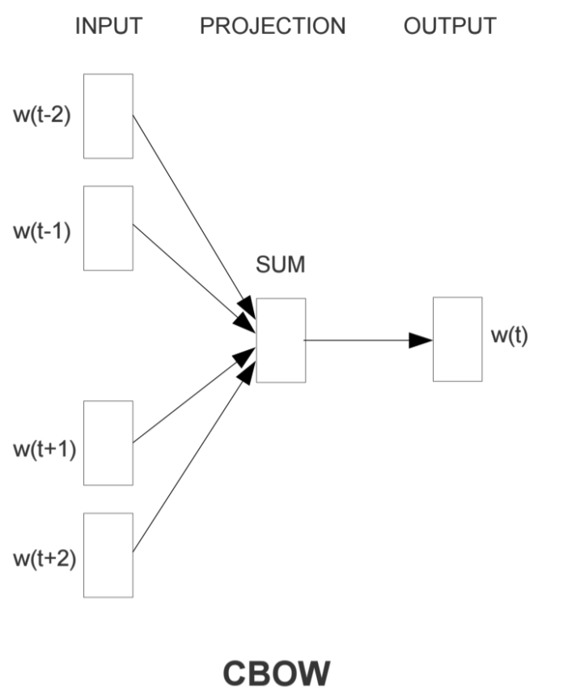

# 论文标题
Distributed-Representation-of-Words-and-Phrases-and-their-Compositionality

## 1.内容概述

本文介绍了word2vec的实现细节及优化技巧，包括负采样损失函数、热门词采样

## 2.细节

### 2.1 Skip-gram Model

### 2.2 Skip-gram损失函数

p(wj|wt)最原始的定义是采用softmax，但是softmax的导数计算复杂度跟词典的大小成正比，计算成本很高

公式中$w_I$表示输入单词，$v_{wI}$表示输入单词embedding，$w_O$表示输出单词，$v^{'}_{wO}$表示输出单词embedding

为解决这个问题，本文提出了两种解决方法：

**1.Hierarchical Softmax**
    
使用树结构近似softmax，树的叶子节点代表每个词，树中的每个节点代表了子节点的概率，一条路径定义了一条Random walk.

Hierarchical Softmax的损失函数如下：

其中$L$表示层数，$n(w, j)$表示w的树路径上的第$j$个节点，`[]`是是否判断，$\sigma$是sigmoid函数。可以验证所有叶子节点的概率之和等于1。

**2.Negative Sampling**

另外一种替代方法是NCE(Noise Contrastive Estimation)。NCE假定一个好的模型能够使用逻辑回归从噪声中区分出有价值数据。

由于Skip-gram只关心embedding，所以在NCE的基础上进行了简化

用以上公式替换Skip-Gram中的$log P(w_O|w_I)$即可，其中$P_n(w)$是负样本抽样方法，文中的经验方法是:$P_n(w)=U(w)^{3/4}/Z$

### 2.3 高频词采样

> Skip-gram model benefits from observing the co-occurrences of “France” and
“Paris”, it benefits much less from observing the frequent co-occurrences of “France” and “the”

> the vector representations of frequent words do not change significantly
after training on several million examples.

文章中采用以下分布对单词进行丢弃

其中t设为`10^-5`左右，$f(w_i)$为$w_i$的频次除以语料库大小。

高频词采样在生成训练样本的时候进行，参考

https://wuwt.me/2019/04/15/word2vector-2019/

## 其他

### CBOW与Skip-gram对比

通过上下文预测中心词

cbow训练快。skip-gram训练更充分，对生僻词好。

对与每个中心词来说，cbow只会学习一次，对于skip-gram来说，会学习K次。skip-gram学习会更充分。

当上线文中有生僻词的时候，cbow的梯度会分散到上下文中，生僻词的学习效率低。skip-gram对每个词单独学习。

