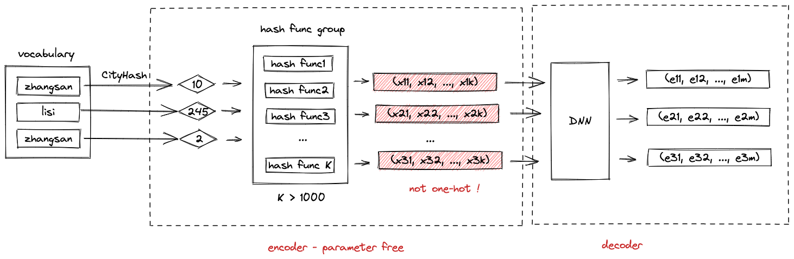
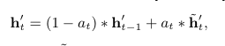
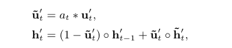

# DIEN

## 动机

用户的兴趣是不断进化的，之前的方法直接将用户行为序列中的item当做用户兴趣，没有建模用户兴趣的变化

## 模型

模型总体结构如上图，有两个特殊结构：Interest Extractor Layer和Interest Evolving Layer。Interest Extractor Layer用来提取用户行为item的兴趣状态，Interest Evolving Layer进行兴趣演化。

### Interest Extractor Layer

使用GRU建模序列信息，引入预测下一个item辅助任务

GRU：

一个负样本的负采样损失：

序列中所有t个元素损失相加，N个样本的损失相加

### Interest Evolving Layer

通过将target与用户行为的每个item计算得到注意力分数，然后将注意力分数与GRU结合进行interest evolution

1. GRU with attentional input(AIGRU)。即将注意力分数乘在第二层GRU的输入上$i_{t}^{'} = h_t * a_t$
2. Attention based GRU(AGRU)。使用注意力分数替代更新门。
   
   

3. GRU with attentional update gate(AUGRU)。AGRU使用一个标量替换更新门，会损失信息。

   
   

## 实验

