# DCN

## DCN-V1

### 动机

DNN的特征交叉效率高，但可解释性不足，DCN引入显示特征自动交叉，并且基本不增加复杂度。

### 模型结构

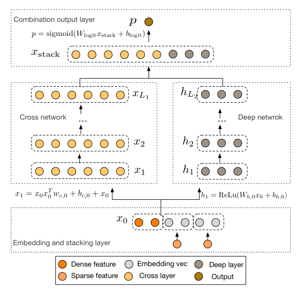

### Cross Network

特征交叉阶数随着层数增加而增加，l层cross，有l+1阶交叉，并且1,2,...,l+1阶交叉都有。

总参数量：$d*L*2$，与层数线性相关，远小于DNN模块参数量，因此复杂度增加有限。

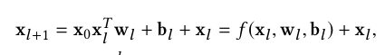

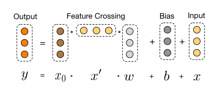

cross模块特点：
1. l层cross，有l+1阶交叉，并且1,2,...,l+1阶交叉都有
2. FM的扩展：$x_{i}$和$x_{j}$的交叉，最终结果只和$w_{l}^{i}$,$w_{l}^{j}$相关，类似FM中的v，增加了泛化性。
3. 高效映射：每一层实际上要把$d^2$个参数映射到$d$维，传统DNN需要$O(d^3)$个参数，cross模块只用了$O(d)$个参数

### Dense Network

$$
h_{l+1} = f(W_{l}h_{l}+b_l)
$$

embedding的维度是d，隐层的维度是m，总层数是$L_d$，则总参数量如下，前两项是embedding层到DNN层变换，后一项是DNN中的参数：

$$
d\times m+m+(m^2+m)\times (L_d-1)
$$

### Combination Layer

将cross和dnn的结果concat之后进行仿射变换，再进行sigmoid输出概率

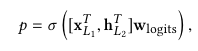

损失函数

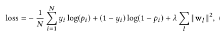

## DCN-V2

### 动机

DCN的cross模块参数太少，限制了模型的表达能力

### 模型结构

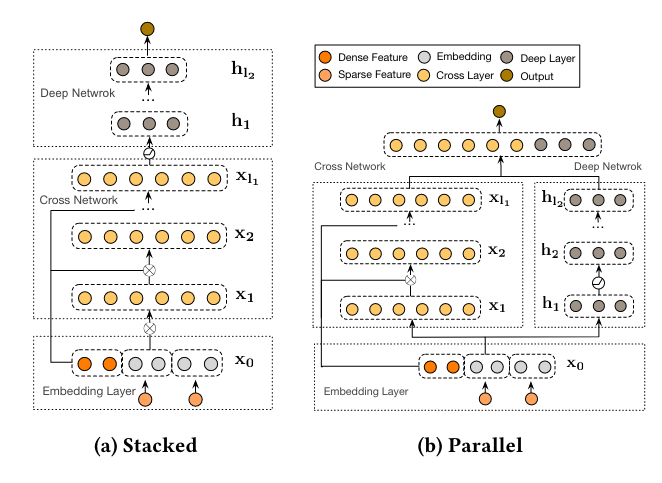

有两种模型结构：Stacked和Parallel

### Cross Network

$$
x_{l+1} = x_0 \odot (W_lx_l+b_l)+x_l
$$

$\odot$表示哈达玛积，对应元素相乘，具体见下图

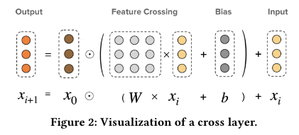

当$W = 1 \times w^T$时，退化到DCN的情况（b有些不一样）

### Deep Network

同DCN

### Deep and Cross Combination

1. Stacked：cross模块后接deep
2. Parallel：cross和deep并行

### 效率提升

由于DCN-V2中将DCN中的向量变成了矩阵，意味着计算量增加，由于线上系统对性能有较高的要求，在性能有限的情况下可尝试如下方法在效果和性能之间trade-off。

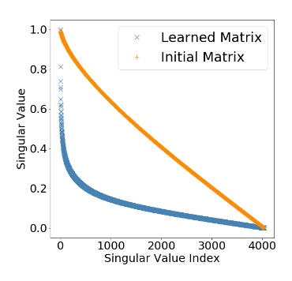

通过后验结果发现，W矩阵收敛之后，特征值会急剧减小，矩阵近似可以看成一个低秩矩阵，用两个小矩阵的乘积进行近似。

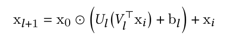

可以从两个角度解释：
1. 在子空间中学习特征交叉
2. 先将特征映射到低维空间，再映射回来

从这两个角度出发，有两种混合模型，有点类似于MOE：

第一种：

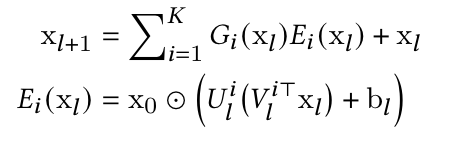

第二种：

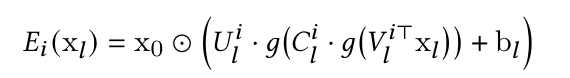

### 模型复杂度

cross部分，完整版DCN-V2复杂度是$O(d^2 \times L_c)$，DCN MIX的复杂度是$O(2drKL_c)$

