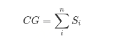
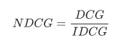

# NDCG

NDCG(Normalized Discounted Cummulative Gain )是度量rank质量的指标，在搜索和推荐中用到较多。

以推荐系统为例，假设系统给某个用户推荐了一个商品列表如下：

T1, T2, T3, ..., Tn

历史数据中有一些指标可以反映用户与这些商品的真实相关性，如点击率：

S1, S2, S3, ..., Sn

我们可以简单将这些真实相关性相加来衡量推荐的结果，这种指标叫CG(cumulative gain)：

但是，CG指标没有考虑推荐列表中商品的顺序，所以在CG的基础上有了个改进叫DCG(discounted CG)：

i是rank位置。

如果使用DCG指标衡量，真实相关性越高的商品排越前面对指标的贡献越大，DCG很好的解决了CG的问题。

但是，系统给每个用户推荐的商品个数可能是不一样的，有的用户可能就天然的点击率就高或者低，导致不同用户、不同推荐列表之间DCG不可比。为解决这一点，就有了NDCG这个指标。

NDCG实际上是对DCG做了归一化处理：

IDCG是指最理想的推荐列表所能得到的DCG分数，比如用户对商品的点击率大小关系如下：

S1 > S2 > S3 > S4 > S5，而实际推荐的列表顺序也是：T1, T2, T3, T4, T5，这就是最理想的情况，这个时候算得DCG就是IDCG。

NDCG是0到1的数，越接近1说明推荐越准确。

参考文章：

http://sofasofa.io/forum_main_post.php?postid=1002561