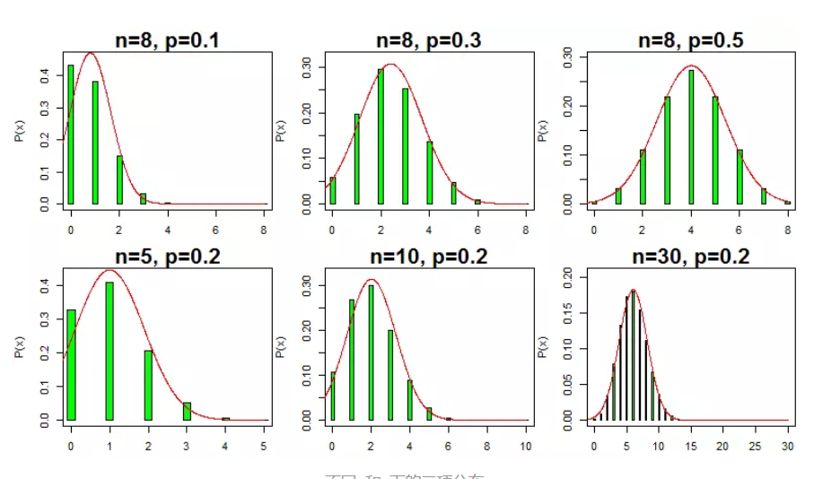

# 二项分布

n次伯努利实验后，成功x次的概率分布是二项分布：

记为：`X~B(n,p)`

均值：np

方差：npq

二项分布的性质：

1. "成功"概率p越接近0.5(也即"成功"概率与"失败"概率越接近)，二项分布将越对称。**保持二项分布试验的次数n不变，随着成功概率p越接近0.5，二项分布逐渐对称，且近似于均值为np、方差为npq的正态分布**。(见下图的第一排3个子图)

2. 对于任意"成功"概率p，**无论其距离0.5有多远，随着试验次数n的增加，二项分布与均值为np、方差为npq的正态分布越来越接近**。(见下图的第二排3个子图)

参考：

https://www.jianshu.com/p/59335680cc29