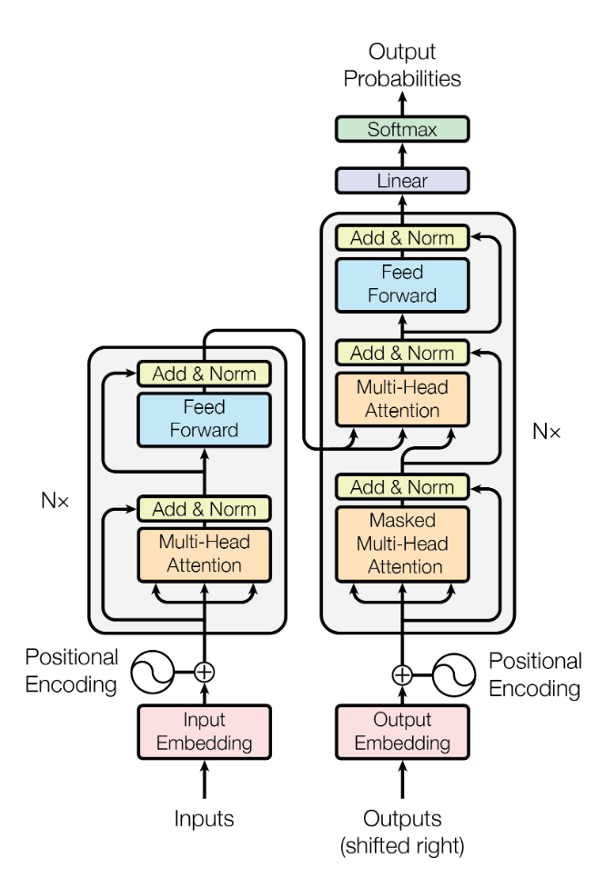
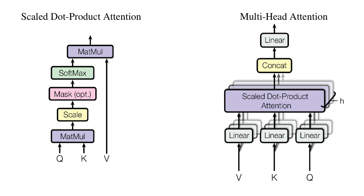
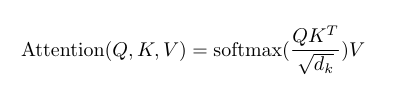
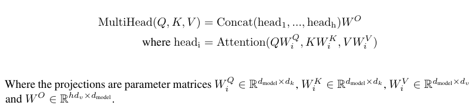
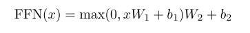
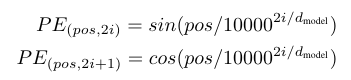
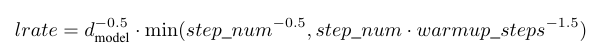
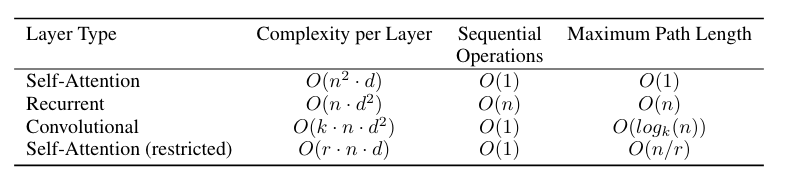

# Transformer

论文：Attention is all you need

## 动机

RNN的问题：依赖前一个结果，无法并行，计算效率低
CNN的问题：如果两个词距离很远，需要很深的网络才能学到之间的联系

## 模型细节

### 模型架构

图中N等于6

**Encoder:**

> 有两个子模块，每个子模块可以表示成
> $$
> x_o = LayerNorm(x_i+Sublayer(x_i))
> $$
> 由于有残差结构，输入和输出维度需要一致，transformer中embedding的维度$d_{model} = 512$

**Decoder:**

> 有三个子模块，其中两个子模块与encoder一致。
> 多一个输入模块。在输入模块中会对注意力的结果进行mask，避免看到后面的信息。具体如何mask看下面注意力一节。

### Attention

**Scaled Dot-Product Attention:**

其中$Q \in (n, d_k), K \in (m, d_k), QK^T \in (n, m)$，n为key的数量，m为value的数量，$V \in (m, d_v)$，最终结果形状为$(n, d_v)$。

为什么除$\sqrt{d_k}$
> 当向量长度很大的时候，点积会比较大，softmax会接近1，导致梯度非常小

**Multi-Head Attention**

出发点：借鉴CNN多通道feature map的思想，通过将Q、K、V投影到多个低维空间，希望模型能够学到更丰富信息。

实际模型中, $h=8, d_k = d_v = d_{model}/h = 512/8=64$。 

细节：
1. encoder中的self-attention中，Q=K=V
2. decoder中的Multi-Head attention, K=V是encoder的结果，Q是decoder的输入的self-attention结果
3. decoder中的Self-attention，使用的是**Masked Multi-Head Attention**。因为计算输出$O_t$时，只能利用$h_1, h_2, ...,h_{t-1}$的结果，$h_t, h_{t+1},...,h_{n}$需要mask掉。实际实现见Scaled Dot-Product Attention图，在计算完$QK^T$结果后，在计算softmax之前，将$h_t, h_{t+1},...,h_{n}$赋予很大的负数，使得softmax结果为0。

### Position-wise MLP

MLP对每个词上进行，先讲$d_{model}$维的向量投影到$d_{ff}$维空间，再降到$d_{model}$，实际模型中$d_{ff}=2048$。

之所以只在词维度上做MLP，是因为每个词的表示已经通过自注意力获取到了整个序列信息了，没必要再做交叉。

### Layer Normalization

参见笔记[LayerNorm](./0007-LayerNormalization.md)

### Positional Encoding

因为自注意力机制没有用到序列信息，Transformer将位置进行编码作为输入。整体思路是生成一个$d_{model}$维度编码信息，Transformer采用的方法固定生成：

也可以对每个位置进行学习，Bert就是采用学习式的。

### Embedding

对所有token Embedding乘上$\sqrt{d_{model}}$。这么做是希望Position Embedding相对较小，避免token embedding信息被掩盖。

## 训练

### 优化器

实际训练采用Adam优化器，学习率规划

前warmup_steps，学习率随着step_num增加而增加。后面随着step_num增加而减小

### 正则化

1. Dropout：在所有LayerNorm和跳连之前加dropout，在token embedding和position embedding相加之前加dropout。droprate=0.1
2. Label Smooth，将正样本的label设为0.1，而不是1

## 为什么使用Self-attention

1. 不需要依赖前置计算(第二个指标)
2. 很容易信息交互(第三个指标)

