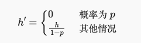

# Dropout原理

## 目的

防止深度网络过拟合

## 原理

在深度网络某些层的随机丢弃节点，假设输出是h，随机丢弃的比例是p，加噪声后输出是：

该层的输出期望不变`E(h')=h`。

训练的时候加dropout，预测时一般不加(也有)。

## 为什么能防止过拟合

1. 有集成学习的思想，每一次drop不同的节点，学到的模型不一样。最后输出结果是多个模型的平均。
2. 打破特征依赖性，因为特征可能会drop，不会严重依赖某些特征
3. 因为增加了随机扰动，模型不会因为输入的微小变化而敏感。

## 经验

1. 前面的层drop概率小，后面的层drop概率大。前面的层提取的是底层特征，drop太大很难收敛。

## 引申

在某些层加入随机扰动是一类方法，也可以加其他噪声，比如$N(0,\sigma^2)$，每一层的输出$x'=x+\epsilon$，$E(x')=x$

## 参考

1. http://zh.d2l.ai/chapter_multilayer-perceptrons/dropout.html?highlight=dropout
2. https://zhuanlan.zhihu.com/p/38200980
