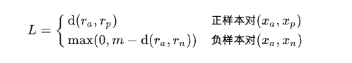
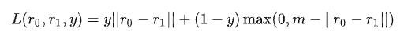
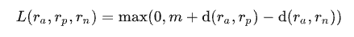
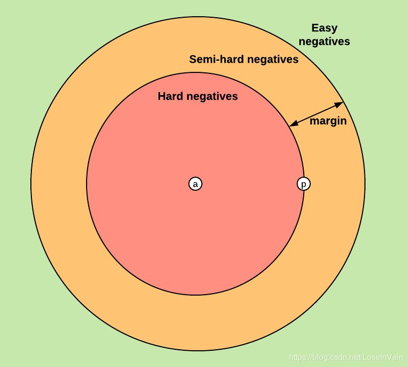

# RankLoss

## Pointwise

以`<anchor, pos>`和`<anchor, neg>`为成对样本，分别计算距离，要求正样本的距离尽可能小，负样本的距离至少大于一个阈值m

综合起来是：

## Pairwise

以`<anchor, pos, neg>`三元组为样本，目标使得`dist(anchor, pos)+m < dist(anchor, neg)`

损失函数：

不同样本表现：
1. Easy negative，损失为0，对训练没有帮助
2. Semi-hard negative，损失不为0，模型有优化空间
3. Hard negtive，损失不为0，模型有优化空间

## 参考

1. https://zhuanlan.zhihu.com/p/158853633