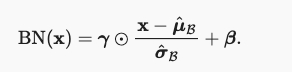
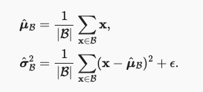
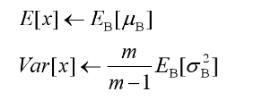
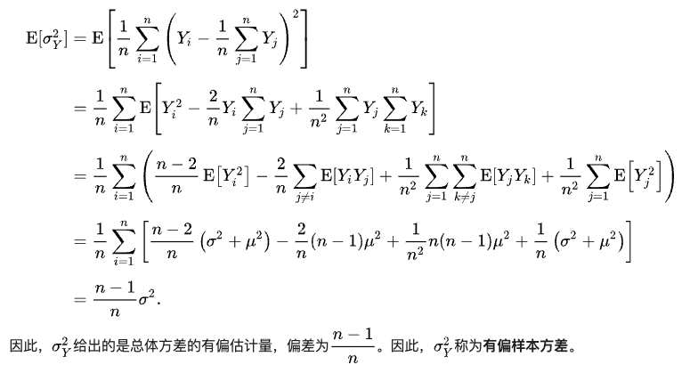
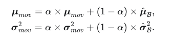
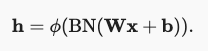
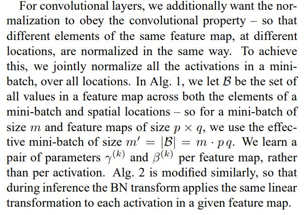

# BatchNormalization

## 目的

1. 加快训练
2. 正则化

## 原理

训练时，对于每一个batch，进行如下操作。先讲输出变成标准正态分布，但是为了保证模型的表达能力，加了伸缩参数，不局限于标准正态分布。下图中所有符号都是向量。

计算方差时会添加一个小的常量，保证方差不为0

预测时，使用总体的均值、方差

总体方差由batch方差推导过程参考样本方差推导: [维基百科](https://zh.m.wikipedia.org/zh-sg/%E6%96%B9%E5%B7%AE)

这种方法需要提前保存每个batch的均值、方差，实际中**采用移动平均的方式**：

$\alpha$通常取较大的数，如0.9

## 解释

### 为什么能加快训练

1. 中间层输出有很广的变化范围，分布变化很大，不利于收敛。仿照输入标准化的思路，将中间层的输入也变为正太分布，有利于收敛。
2. 数学上可以证明，Loss对bn的输出$\hat{y}$的导数范数是有界的，参数更新会更平滑。参考[维基百科](https://en.wikipedia.org/wiki/Batch_normalization)

### 为什么有正则化的效果

单个样本的输出混入了batch的信息，相当于噪声，在训练中加入噪声一般有助于缓解过拟合，dropout也是一种噪声

## 应用

全量接层：在进非线性激活之前，输入是$n*d$,在特征维度上做BN，得到$1 \times d$的均值和方差

卷积层：在卷积之后，非线性激活之前，在每个通道上做BN，每个通道有不同的拉伸参数。假设batch大小是m，feature map大小是$q \times p$，channel数是$c$，总体输入形状是$m*p*q*c$，得到$1 \times c$的均值和方差。

为什么卷积跟全连接不一样？原文是说希望同一个feature map的不同元素使用相同的标准化方式，遵循卷积参数共享的性质。

## 缺点

1. batch_size小的时候效果差，样本均值和方差估计不准
2. 无法用于RNN。同一个batch中的sequence长度可能不一样，按batch维度来计算均值、方差是不准确的，因为有的为空。另外，即使可以使用，需要保存每个时间步的均值、方差，比较麻烦。RNN使用Layer Normalization代替，LayerNormalization是在样本维度做归一化。

