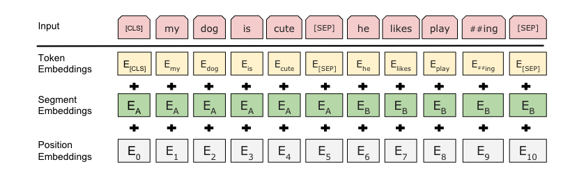
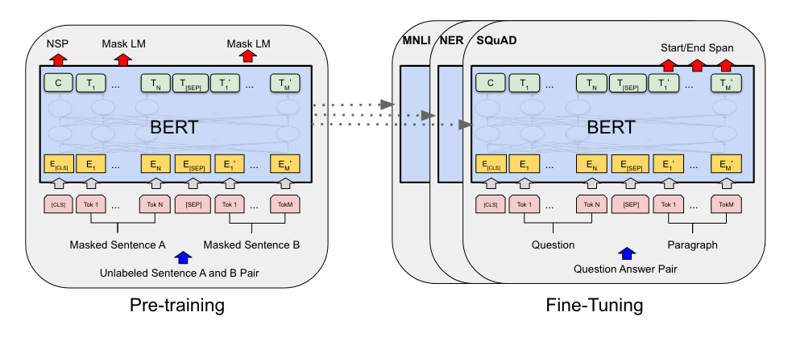

# Bert

## 动机

借鉴两个工作：
1. ELMo，用的RNN的架构。feature-based方法，做下游任务需要进行调整。Bert是finetune-based方法，做下游任务不用大调整。
2. GPT，用的单向Transformer。在做句子粒度任务，QA任务时，是能看到完整句子的，单向模型损失了信息。Bert使用了双向信息。

## 模型结构

Transformer的Encoder部分，有3个可调节参数：
1) L: Transformer基础块的堆叠层数
2) H: 隐层单元数量，embedding维度
3) A: 多头注意力数量
   
Bert Base: L=12，H=768，A=12，110M参数
Bert Large: L=24，H=1024，A=16，340M参数

与Transformer不同的是，Bert中的Position Embedding使用可学习的参数。

## 预训练

有两个预训练任务：
1. Masked LM：对句子中15%的词进行mask，然后进行预测。其中80%用[MASK]代替，10%用随机的词替代，10%保留原词(因为预测的时候会输入词)
2. Next Sentence Prediction：输入句子A-B，判断B是否为A的下一句。50%的B是下一句，50%不是
   

## Finetune

对于token粒度的任务，可以将token representation输出到output layer。句子粒度的任务可以使用[CLS]输出到output layer

常见问题，参考[知乎](https://zhuanlan.zhihu.com/p/524036087)：
1. 使用误差修正，训练收敛变快，效果变好。原始Bert使用的adam没有做误差修正，收敛速度会慢，可以进行修正。
2. bert层数很深，如果数据集较小，可以固定底层权重，如1-6层。
3. 只用部分层参数初始化新模型，如底部1-6层
4. 训练warmup，一开始使用较大的学习率，然后逐渐减小

