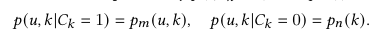
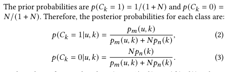
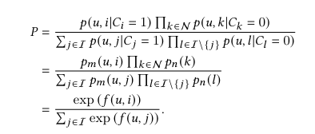
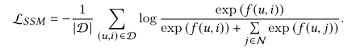
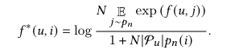
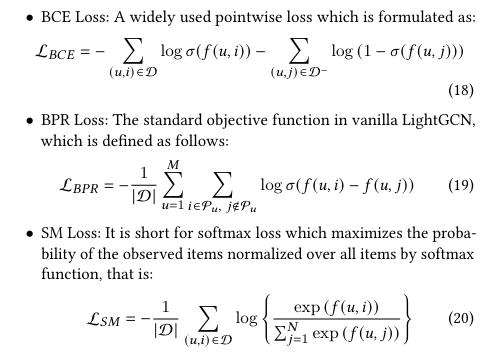

# Sampled Softmax(SSM)

在推荐召回模型中，listwise训练方法常用到Sampled Softmax(SSM)损失函数，非常适合TOP-K模型。

## 原理

出发点与NCE相似，对于每个正样本，抽样n个负样本，正样本按实际样本分布抽样，使用模型逼近，负样本是模型无关概率

可推导条件分布为，与NCE相同

如果使用sigmoid函数计算条件概率，即

$$
p(C_k=1|u,k) = \frac{p_m(u,k)}{p_m(u,k)+Np_n(k)}=\sigma(f(u,k))
$$
可推导出：
$$
p_m(u,k) = Np_n(k)exp(f(u,k))
$$

SSM的优化目标是使当前样本组合出现的联合概率最大，其中$N$表示负样本集合，$I$表示包含正样本和负样本的集合，有以下推导结果(代入了上式)

由此可得损失函数：

## 性质

参见[论文](https://arxiv.org/pdf/2201.02327.pdf)
1. 可以缓解流行度偏差，通过对f(u,i)求导可得一下闭式解，可以看出，如果p_n(i)越大，即流行度越高，分数越小

2. 有利于难样本学习
3. 优化SSM与优化DCG指标等同

## 常见损失对比

常见point-wise，pair-wise和list-wise损失对比

## 参考

1. [On the Effectiveness of Sampled Softmax Loss for Item Recommendation](https://arxiv.org/pdf/2201.02327.pdf)