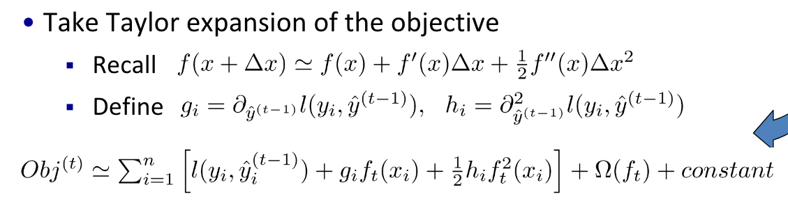
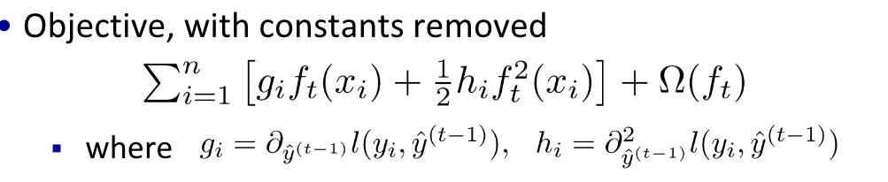
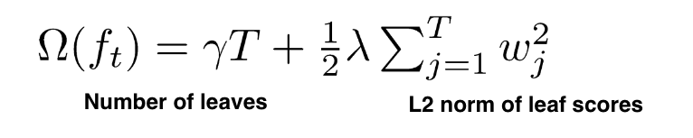
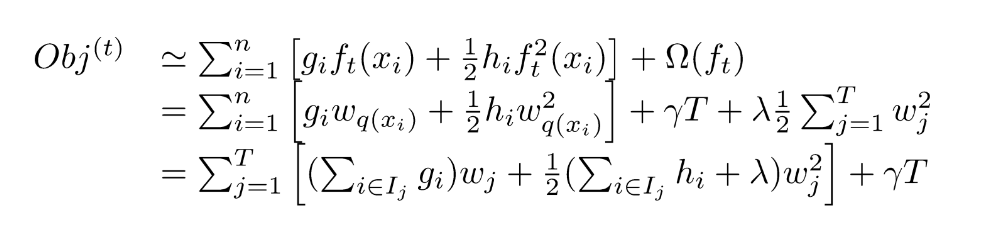
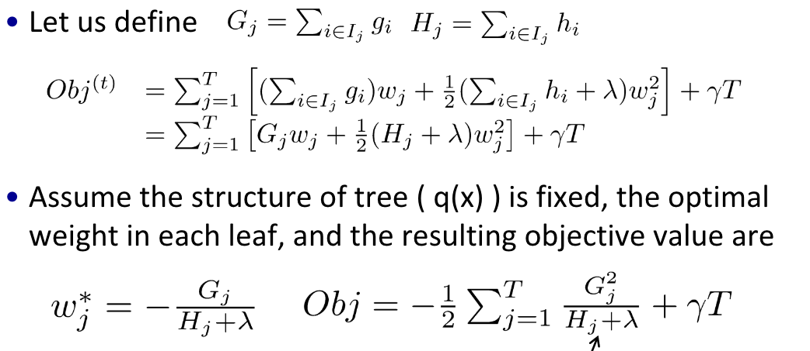
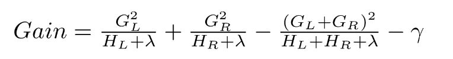
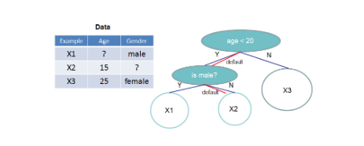
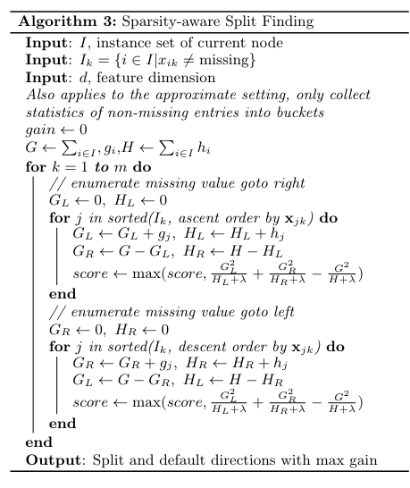
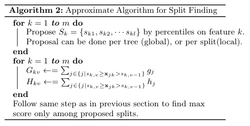
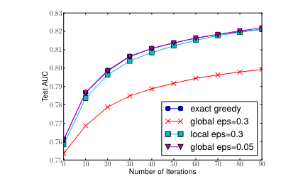

# Xgboost

Xgboost是gbdt算法的一种实现框架，但在算法细节上与原始gbdt也所有差异

理解原理需要先理解[GBDT](./0019-GBDT.md)与[CART](./0017-CART%E7%AE%97%E6%B3%95.md)算法。

## 目标

与GBDT一样，Xgboost同样使用前向分步法求解加性模型
$$
\hat y_i = \sum_{k=1}^K f_k(x_i) \\
\hat y_{i}^t = \hat y_{i}^{t-1} + f_t(x_i)
$$
不一样的是在求解每一步模型时就考虑模型正则化
$$
\begin{aligned}
    Obj^t &= \sum_{i=1}^{N} l(y_i, \hat y_i^{t}) + \sum_{i=1}^{t} \Omega(f_i) \\
        &= \sum_{i=1}^{N} l \left(y_i, \hat y_{i}^{t-1} + f_t(x_i) \right) + \Omega(f_t) + const
\end{aligned}
$$

使用泰勒展开对损失函数进行近似

**解释**：将$l(y_i, \hat y_{i}^{t-1})$看成$f(x)$，如果样本加权，将$a_i l(y_i, \hat y_{i}^{t-1})$看成$f(x)$，$f_t(x_i)$看成$\Delta x$。与GBDT一样，在梯度的负方向上，损失较小最快。只不过GBDT用的是一阶梯度，Xgboost里用了二阶梯度。

## 正则化

可以有多种正则化条件，如
1. 叶子节点的个数，防止过拟合
2. 树的深度，防止过拟合
3. 叶子节点输出的L2范数，让输出更平滑

如果以1和3为正则化项

## 求解

对目标函数进行化简，可以得到如下结果，其中$w_{q(x_i)}$表示样本$x_i$属于的$q(x_i)$叶子节点的输出值，一个叶子节点内的输出值一样。

这是T个一元二次方程方程，有闭式解

## 模型构建

1. 开始第t次迭代
2. 对每个样本计算$g_i$,$h_i$
3. 自定向下构建树：
   1. 起始只有一个根节点，包含所有样本
   2. 遍历每个特征，遍历每个分割点（对样本以特征进行排序，从左往右扫描），计算
    
   3. 取使Gain最大的分割点
4. 模型更新，每次模型更新会乘上一个系数$\epsilon$,通常设为0.1，类似于学习率。表示每次不会步子跨太大，给后面模型机会，防止过拟合。
   $$
    \hat y_{i}^t = \hat y_{i}^{t-1} + \epsilon f_t(x_i)
   $$

总体时间复杂度O(M n d k log n)，M次迭代，d个特征，每个特征nlogn排序（计算Gain最大O(n)可忽略），k层需要做k次。

对于离散特征，使用one-hot编码代替原有特征，应用以上方法处理即可。

如果Gain太小，甚至小于0可以停止构建。或者构建完之后，再将Gain小于0的节点剪枝掉。

## 算法优化

### 缺失值处理

对于每个特征，所有缺失值样本一起考虑，学习一个default direction（左边或右边）分别计算Gain，选择最大的分割方式。

实际实现的时候，只用遍历非缺失值即可。特征值从小往大遍历的时候，前n_left个样本的$G_L$进行累加，$G_R = G_L$，H同理。相当于将default分在了右边。再根据特征从大往小遍历样本，相当于把default分在了左边。具体算法如下：

### 分割点

不用枚举所有样本，对特征值区间[min, max]进行分桶，枚举分割点。有两种策略：
1. Global：全局共享一个分桶策略
2. Local：每个节点节点单独进行分桶
   

下图中exact greedy是遍历所有样本，可以发现global和local都可以达到与exact greedy差不多精度，global需要更细得分桶。

## 工程优化

### 特征值排序并存储

将所有特征的排序提前处理，并且每个特征的排序结果存起来。在进行特征选择和分割点寻找的时候可以并行。

优化前复杂度：$O(Kd||x||_0\log n)$，其中K是树的个数，d是树的最大深度，$||x||_0$是非缺失值个数。

优化后复杂度：$O(Kd||x||_0+||x||_0\log n)$

### cache-aware预取

特征排序存储后，计算的时候需要取对应样本的g和h，但是样本是不连续的，会导致cache miss。可以在计算的时候，把需要的g和h提前预取出来放到一个buffer里。

### out-of-core computation

当训练样本太大无法全部加载到内存中时，会把数据分成许多个block并存储在硬盘中，需要计算的时候，用另一个线程加载数据到内存中，这样读取与计算可以同步进行。但是我们知道从磁盘读取数据会比较耗时，因此作者又提出了两个优化方法去解决这个问题。

第一个方法叫做Block compression，将block按列压缩存储，读取的时候用另外的线程边读取边解压；第二个方法叫做Block sharding，是将数据划分到不同磁盘上，为每个磁盘分配一个预读取线程，并将数据提取到内存缓冲区中，然后训练线程交替地从每个缓冲区读取数据。这有助于在多个磁盘可用时增加磁盘读取的吞吐量。

## Xgboost与GBDT算法上的区别

1. 目标函数不一样，Xgboost考虑了正则化，GBDT只有经验损失。
2. Xgboost进行了二阶求导，误差下降更快。GBDT只进行了一阶梯度。
3. Xgboost可以支持其他基分类器，GBDT是CART树。
4. Xgboost加了Shrinkage，每次更新会乘上一个系数
5. Xgboost会进行列采样，参见[随机森林](./0021-%E9%9A%8F%E6%9C%BA%E6%A3%AE%E6%9E%97.md)

## 参考

1. https://xgboost.readthedocs.io/en/stable/tutorials/model.html
2. https://arxiv.org/abs/1603.02754
3. https://zhuanlan.zhihu.com/p/125594314

