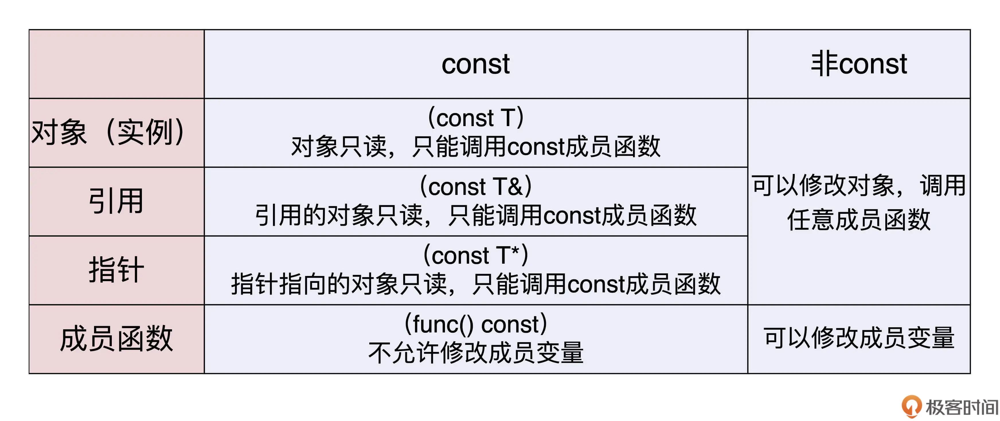

# const

## const变量

const可以赋予变量只读的属性，多用有利于编译器优化代码。比如，编译器会在编译阶段将常量替换成初始值。

```c++
const int MAX_LEN = 1024;
const std::string NAME = "metroid";
```

## const引用与const指针


```c++

int x = 100;
const int& rx = x;  // 常量引用，不能改变引用的对象
const int* px = &x; // 常量指针，不能改变指针对应的对象

string* const ps2 = &name;  // 指向变量可变，但指针本身不能被修改
*ps2 = "spiderman";        // 正确，允许修改

const string* const ps3 = &name;  // 指针和指向的变量都不可变，可读性差尽量不用

```

## const成员函数

```c++

class DemoClass final
{
private:
    const long  MAX_SIZE = 256;    // const成员变量
    int         m_value;           // 成员变量
public:
    int get_value() const        // const成员函数
    {
        return m_value;
    }
};
```

类成员函数可以定义成const，表明这个函数是只读函数，不会改变成员变量的值。

const的实例只能调用const函数。




