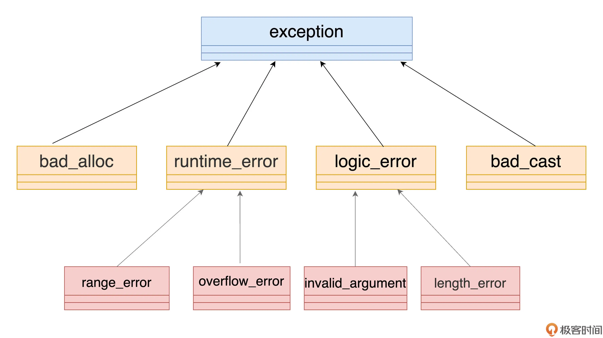

# 异常

## 为什么要有异常

一种最原始处理异常的方法是异常码，这种方法处理异常有如下缺点：
1. 异常处理与正常代码混合在一起
2. 异常可能被忽略，可以不处理
3. 有的函数不返回值，强行返回异常吗不优雅

```c++

int n = read_data(fd, ...);    // 读取数据

if (n == 0) {
  ...                    // 返回值不太对，适当处理
}

if (errno == EAGAIN) {
  ...                    // 适当处理错误
}
```

C++的通过try-catch异常机制可以解决如上问题:
1. 通过catch块处理异常，与正常业务逻辑独立
2. 抛出异常一定要被解决，没有catch会不断向上传播
3. 函数可以抛出异常，不用返回值

## 异常用法

C++内置了很多异常类(`#include<stdexcept>`)，也可以选择继承某个异常类自定义异常



```c++
//自定义异常
class my_exception : public std::runtime_error
{
public:
    using this_type     = my_exception;        // 给自己起个别名
    using super_type    = std::runtime_error;  // 给父类也起个别名
public:
    my_exception(const char* msg):            // 构造函数
        super_type(msg)                      // 别名也可以用于构造，调用父类构造函数
    {}  

    my_exception() = default;                // 默认构造函数
   ~my_exception() = default;                // 默认析构函数
private:
    int code = 0;                            // 其他的内部私有数据
};

// 封装异常
[[noreturn]]                      // 属性标签，编译优化
void raise(const char* msg)      // 函数封装throw，没有返回值
{
    throw my_exception(msg);     // 抛出异常，也可以有更多的逻辑
}

// try catch使用方法
try
{
    raise("error occured");     // 函数封装throw，抛出异常
}
catch(const my_exception& e)      // const &捕获异常，可以用基类
{
    cout << e.what() << endl;  // what()是exception的虚函数
}
catch(const exception& e)  // 可以多个catch
{
    ...
}

// function try用法
int get_value(const vector<int> &arr, int index) 
try
{
    if (index < 0 || index >= arr.size()) {
        throw range_error("out of range");
    }
    return arr[index];
}
catch (const exception& e)
{
    cout << e.what() << endl;
    return -1;
}

int main() {
    vector<int> arr(10,1);
    cout << get_value(arr, 100) << endl;
}

//noexcept
void func_noexcept() noexcept     // 声明绝不会抛出异常，但是实际可以抛，这个声明方便编译器优化代码
{
    cout << "noexcept" << endl;
}
```
可以使用多个catch，但异常只能按照 catch 块在代码里的顺序依次匹配，而不会去找最佳匹配。最好使用一个catch。

## 注意

不要不使用异常，也不要过多使用异常。异常有成本，发生异常时会进行栈展开，即不断向上弹出调用栈，直到遇到可以处理异常的catch，如果异常调用很深，频繁发生异常会导致性能下降。

几个应当使用异常的判断准则，可以有其他：
1. 不允许被忽略的错误；
2. 极少数情况下才会发生的错误；
3. 严重影响正常流程，很难恢复到正常状态的错误；
4. 无法本地处理，必须“穿透”调用栈，传递到上层才能被处理的错误。

比如说构造函数，如果内部初始化失败，无法创建，那后面的逻辑也就进行不下去了，所以这里就可以用异常来处理。

比如说网络通信，因为网络经常不稳定，频繁抛出异常成本很高，可以不使用异常。

## 参考
1. https://time.geekbang.org/column/article/240292
2. https://learn.microsoft.com/zh-cn/cpp/cpp/exceptions-and-stack-unwinding-in-cpp?view=msvc-170
3. https://blog.csdn.net/shltsh/article/details/46039365