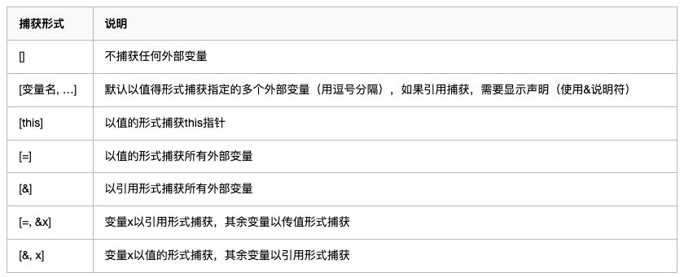

# lambda

C++11开始引入了lambda函数，lambda函数与普通函数最大的不同点在于lambda函数是个变量，可以进行赋值。

## 使用方法

```c++
auto f2 = []()                 // 定义一个lambda表达式
{
    cout << "lambda f2" << endl;

    auto f3 = [](int x)         // 嵌套定义lambda表达式
    {
        return x*x;
    };

    cout << f3(10) << endl;
}; 
```

在 C++ 里，每个 lambda 表达式都会有一个独特的类型，而这个类型只有编译器才知道，我们是无法直接写出来的，所以必须用 auto。

## 变量捕获

lambda函数可以捕获可见范围内的局部变量（全局、静态变量可以直接使用），在函数体内使用。有两种捕获方式：值捕获和引用捕获。值捕获不能修改变量值，引用捕获可以修改变量值。



```c++

int x = 33;               // 一个外部变量

auto f1 = [=]()           // lambda表达式，用“=”按值捕获
{
    //x += 10;            // x只读，不允许修改，会报错
};

auto f2 = [&]()         // lambda表达式，用“&”按引用捕获
{
    x += 10;            // x是引用，可以修改
};

auto f3 = [=, &x]()       // lambda表达式，用“&”按引用捕获x，其他的按值捕获
{
    x += 20;              // x是引用，可以修改
};
```

## 泛型

lambda函数的参数列表可以使用auto关键字，达到泛型效果。

```c++
auto f = [](const auto& x)        // 参数使用auto声明，泛型化
{
    return x + x;
};

cout << f(3) << endl;             // 参数类型是int
cout << f(0.618) << endl;         // 参数类型是double

string str = "matrix";
cout << f(str) << endl;          // 参数类型是string
```

