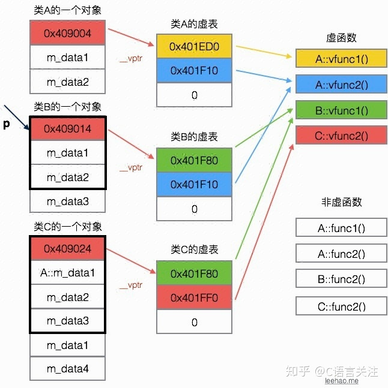

# 虚函数

C++通过虚函数实现多态

## 用法

- 成员函数前加virtual关键字声明虚函数，与基类签名相同的函数即使没有写virtual，也是虚函数，最好写。
- 虚函数后面加"=0"标识纯虚函数，包含纯虚函数的类是抽象基类，类似java中的接口。不能实例化。
- 重写虚函数时可以用override标记，防止不小心函数签名写错导致引入新的成员函数，override可以编译检查。

```c++

// 抽象类
class Base {
public:
    virtual void vfunc() = 0 ;  // 纯虚函数
}

class A {
public:
    virtual void vfunc1() {
        cout << "A vfunc1" << endl;
    };
    virtual void vfunc2() {
        cout << "A vfunc2" << endl;
    };
    void func1(){};
    void func2(){};
private:
    int m_data1, m_data2;
};

class B : public A {
public:
    virtual void vfunc1() override {  // override标记重写函数，可以不写，写可以防止函数签名写错生成新的函数
        cout << "B vfunc1" << endl;
    };
    void func1(){};
private:
    int m_data3;
};

class C: public B {
public:
    virtual void vfunc2(){
        cout << "C vfunc2" << endl;
    };
    void func2(){};
private:
    int m_data1, m_data4;
};


int main() {
    B b;
    A* p = &b;
    p->vfunc1(); // 输出 "B vfunc1"

    cout << sizeof(A) << endl; // 16，一个虚表指针8字节+2个int
    cout << sizeof(B) << endl; // 24，A的基础上加上一个int，但是要内存补齐到8字节
    cout << sizeof(C) << endl; // 32，B的基础上先补齐一个int到8，还剩一个int补齐到8，相当于+8；
}
```

## 对象模型

上面例子的对象模型：
1. 每个类都有一个虚表
2. 每个类对象都有一个指向虚表的指针，排在所有数据之前




## 参考

- https://zhuanlan.zhihu.com/p/75172640