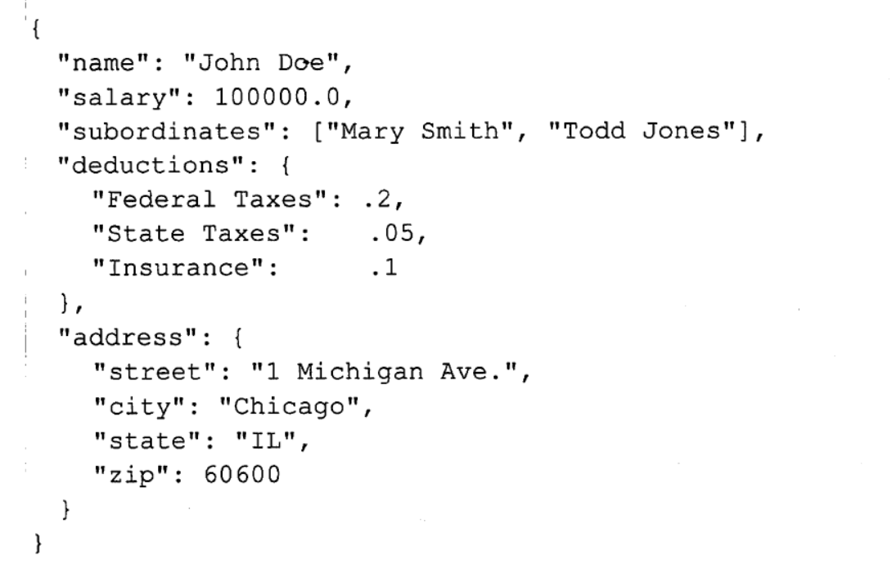

# 文本文件数据编码

hive中默认的记录和字段分隔符

| 分隔符 | 描述                                                         |
| ------ | ------------------------------------------------------------ |
| `\n`   | 记录分隔符，一行一条记录                                     |
| `^A`   | 列分隔符，八进制编码`\001`                                   |
| `^B`   | ARRAY和STRUCT中元素分隔符，MAP中键值对之间的分隔符。八进制编码`\002` |
| `^C`   | MAP中键值之间的分隔符, 八进制：`\003`                        |

```sql
create table employees(
    name string,
    salary float,
    subordinates array<string>,
    deductions map<string, float>,
    address struct<street:string, city:string, state:string, zip:int>
)
row format delimited
fields terminated by '\001'
collection items terminated by '\002'
map keys terminated by '\003'
lines terminated by '\n'
stored as textfile;
```

以上语句可以自定义分隔符。其中`row format delimited`这组关键字必须写在其他子句之前。

如果以以上语句创建表，以下是一条记录：


