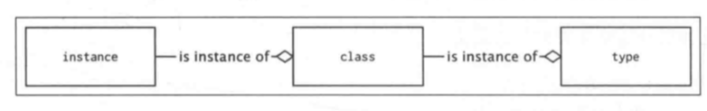

# 元编程

> 元编程是一种编写计算机程序的技术，这些程序可以将自己看做数据，因此你可以在运行时对它进行内省、生成和修改

## 装饰器

装饰器是一种元编程方法，接收一个函数对象，并修改这个函数的功能，清查看`0015`

## 类装饰器

`0015`记录的是函数装饰器的方法，但是也有装饰类的装饰器，即返回类对象而不是函数对象

```python
def short_repr(cls):
    cls.__repr__ = lambda self: super(cls, self).__repr__()[:9] # __repr__接收self参数，输出由self决定，即使是父类调用
    return cls


@short_repr
class ClassWithRelativelyLongName(object):
    pass


tmp = ClassWithRelativelyLongName()
print(tmp)

==>
<__main__
```

以上程序表明：

1. 类对象可以被修改
2. 函数也是描述符
3. super可以在类的外面被调用
4. 装饰器可以修改类定义

函数装饰器的写法都可以用于类装饰器：

```python
def parametrized_short_repr(max_width=9):
    def short_repr(cls):
        cls.__repr__ = lambda self: super(cls, self).__repr__()[:max_width]
        return cls
    return short_repr

@parametrized_short_repr(10)
class ClassWithRelativelyLongName(object):
    pass


tmp = ClassWithRelativelyLongName()
print(tmp)
```

**可以在类装饰器中修改类定义，提供一些可复用的API或功能**

## 使用`__new__`重写实例创建过程

`__new__`是一种负责创建类实例的静态方法，`__new__`的调用优先级高于`__init__`，可以再`__new__`中修改类实例

```python
class InstanceCounter:
    instance_created = 0
    def __new__(cls, *args, **kwargs):
        print('__new__() called')
        instance = super().__new__(cls)
        instance.number = cls.instance_created
        cls.instance_created += 1
        return instance

    def __init__(self):
        print('__init__() called')

inst1 = InstanceCounter()
inst2 = InstanceCounter()
print(inst1.number, inst1.instance_created)
print(inst2.number, inst2.instance_created)

==>
__new__() called
__init__() called
__new__() called
__init__() called
0 2
1 2
```

`__new__`方法可以返回其他类的实例(**要传cls参数**)，如果是这种情况，`__init__`函数将被跳过

```python
class NoneZero(int):
    def __new__(cls, value):
        return super().__new__(cls, value) if value != 0 else None

    def __init__(self, value):
        print('__init__() called')
        super().__init__()

print(type(NoneZero(10)))
print('--')
print(type(NoneZero(0)))
==>
__init__() called
<class '__main__.NoneZero'>
--
<class 'NoneType'>
```

**只有在`__init__`方法不够用的时候才使用`__new__`方法，如对python的不可变类型进行子类化。但是大多数情况下，使用其他方法能够代替`__new__`方法，所以尽量不要使用。**

## 元类

> 定义了对象实例的类也是对象
>
> 

**元类是定义其他类(型)的一种类(型)。**

使用type可以定义其他类

```python
def method(self):
    return  1

kclass = type('MyClass', (object,), {'method': method})

instance = kclass()
ret = instance.method()
print(ret)
==>
1
```

等价于

```python
class MyClass:
    def method(self):
        return 1

instance = MyClass()
ret = instance.method()
print(ret)
==>
1
```

使用class语句创建的每个类都隐式地使用type作为其元类，可以通过向class语句提供metaclass关键字参数来改变这一默认行为。

```python
class ClassWithMetaclass(metaclass=type):
    pass
```

metaclass参数通常是另一个类对象，但它可以是任意可调用对象，只要接受与type相同的参数并返回另一个类对象即可。参数有：

- name：类名称，成为`__name__`
- bases：父类列表，成为`__base__`属性，用于构建MRO
- namespace：类主体定义的命名空间，成为`__dict__`属性

以下代码揭露元类工作方式：

```python
class RevealingMeta(type):
    def __new__(mcs, name, bases, namespace, **kwargs): # step 2：创建对象
        print(mcs, "__new__ called", kwargs)
        return super().__new__(mcs, name, bases, namespace)

    @classmethod
    def __prepare__(mcs, name, bases, **kwargs): # step 1:准备命名空间
        print(mcs, "__prepare__ called", kwargs)
        print(super().__prepare__(name, bases, **kwargs)) # namespace
        return super().__prepare__(name, bases, **kwargs)

    def __init__(cls, name, bases, namespace, **kwargs): # step 3：初始化元类实例，即类对象
        print(cls, "__init__ called", kwargs)
        super().__init__(name, bases, namespace)

    def __call__(cls, *args, **kwargs): # step 4. 创建RevealingClass实例时会调用(RevealingClass是RevealingMeta的实例)
        print(cls, '__call__ called', *args, **kwargs)
        return super().__call__(*args, **kwargs)


class RevealingClass(metaclass=RevealingMeta, extra = "value"):
    def __new__(cls): # step 5
        print(cls, "__new__ called")
        return super().__new__(cls)

    def __init__(self): # step 6
        print(self, "__init__ classed")
        super().__init__()


instance = RevealingClass(metaclass=RevealingMeta)

==>
<class '__main__.RevealingMeta'> __prepare__ called {'extra': 'value'}
{}
<class '__main__.RevealingMeta'> __new__ called {'extra': 'value'}
<class '__main__.RevealingClass'> __init__ called {'extra': 'value'}
<class '__main__.RevealingClass'> __call__ called
<class '__main__.RevealingClass'> __new__ called
<__main__.RevealingClass object at 0x10b8ec890> __init__ classed
```

python2中class语句不支持关键词参数，需要在`__metaclass`中指定元类，也可以使用six库，而且python2中不支持`__prepare__`

```python
from six import with_metaclass

class Meta(type):
    pass

class Base(object):
    pass

class MyClass(with_metaclass(Meta, Base)):
    pass
```

**元类总可以找到其他的方法替代，元类真正适合的地方是框架**