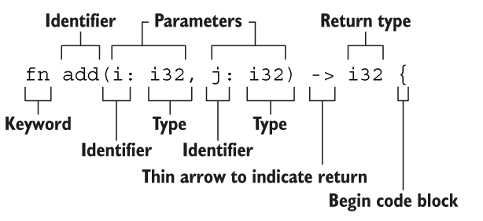

# 语句与表达式

有返回值的是表达式，没有返回值的是语句

> 表达式不能用分号

```rust
fn add_with_extra(x: i32, y: i32) -> i32 {
    let x = x + 1; // 语句：没有返回值
    let y = y + 5; // 语句：没有返回值
    x + y // 表达式: 有返回值
}
```

# 函数



- 函数名和变量名使用蛇形命名法(snake case)，例如fn add_two() -> {}
- 函数的位置可以随便放，Rust不关心我们在哪里定义了函数，只要有定义即可
- 每个函数参数都需要标注类型
- 函数的返回值类型也需要显示定义
- 提前返回用return

```rust
fn main() {
    let result = add_with_extra(11,2);
    println!("{}", result);
}

fn add_with_extra(x: i32, y: i32) -> i32 {
    if x > 10 {
        return x + y - 9 // 可加分号，也可不加
    }
    x + y
}
```
