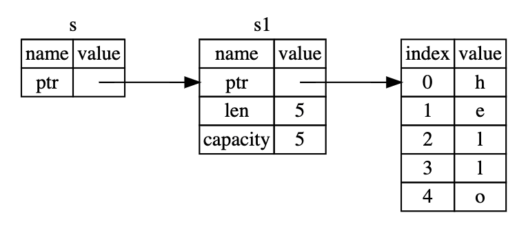

# 所有权

原则
- Rust中每一个值都有且只有一个所有者(变量)
- 当所有者(变量)离开作用域范围时，这个值将被丢弃(free)


```rust
let s1 = String::from("hello"); // s1存在栈中，是一个包含指向堆内存、分配内存大小、已用内存大小的数据结构。"Hello"的值存放在堆中。
let s2 = s1; // hello 所有权转移, s1不再指向hello。
println!("{}, world!", s1); // error

let x = 5;
let y = x; // 浅拷贝
println!("x = {}, y = {}", x, y); // ok
```

> 1. Rust不会自动创建深拷贝
> 2. 浅拷贝发生在栈上，速度较快
> 3. 具有Copy特征(接口)的类型赋值后仍可以使用，如上面y=x

```rust
fn main() {
    let s = String::from("hello");  // s 进入作用域

    takes_ownership(s);             // s 的值移动到函数里 ...
                                    // ... 所以到这里不再有效
    println!("{}", s);              // error

    let x = 5;                      // x 进入作用域

    makes_copy(x);                  // x 应该移动函数里，
                                    // 但 i32 是 Copy 的，所以在后面可继续使用 x

} // 这里, x 先移出了作用域，然后是 s。但因为 s 的值已被移走，
  // 所以不会有特殊操作

fn takes_ownership(some_string: String) { // some_string 进入作用域
    println!("{}", some_string);
} // 这里，some_string 移出作用域并调用 `drop` 方法。占用的内存被释放

fn makes_copy(some_integer: i32) { // some_integer 进入作用域
    println!("{}", some_integer);
} // 这里，some_integer 移出作用域。不会有特殊操作
```

函数值返回值也有所有权

```rust
fn main() {
    let s1 = gives_ownership();         // gives_ownership 将返回值
                                        // 移给 s1

    let s2 = String::from("hello");     // s2 进入作用域

    let s3 = takes_and_gives_back(s2);  // s2 被移动到
                                        // takes_and_gives_back 中,
                                        // 它也将返回值移给 s3
} // 这里, s3 移出作用域并被丢弃。s2 也移出作用域，但已被移走，
  // 所以什么也不会发生。s1 移出作用域并被丢弃

fn gives_ownership() -> String {             // gives_ownership 将返回值移动给
                                             // 调用它的函数

    let some_string = String::from("hello"); // some_string 进入作用域.

    some_string                              // 返回 some_string 并移出给调用的函数
}

// takes_and_gives_back 将传入字符串并返回该值
fn takes_and_gives_back(a_string: String) -> String { // a_string 进入作用域

    a_string  // 返回 a_string 并移出给调用的函数
}
```

# 引用与借用

因为一个值只能有一个所有者，所有权会经常转移，如从主函数转移到子函数中，如果没有被返回，主函数将无法使用这个值，不利于开发。Rust将值通过引用借用给其他变量，提高开发效率。

```rust
fn main() {
    let s1 = String::from("hello");

    let len = calculate_length(&s1);

    println!("The length of '{}' is {}.", s1, len);
}

fn calculate_length(s: &String) -> usize {
    s.len()
}
```



## 可变引用与不可变应用

因为变量默认是不可变的，引用默认也是不可变的，即不能修改指向的值。

```rust
fn main() {
    let s = String::from("hello");
    change(&s);
}

fn change(some_string: &String) {
    some_string.push_str(", world"); //error
}
```

可以声明可变引用

```rust
fn main() {
    let mut s = String::from("hello");
    change(&mut s);
}

fn change(some_string: &mut String) {
    some_string.push_str(", world");
}
```

> 1. 在同一作用域，可变引用只能出现一个（防止数据竞争）
> 2. 在同一个作用域，可变引用与不可变引用不能同时存在（不可变引用不希望自己读的数据变了）
> **注意，引用的作用域s从创建开始，一直持续到它最后一次使用的地方，这个跟变量的作用域有所不同，变量的作用域从创建持续到某一个花括号`}`**

```rust
let mut s = String::from("hello");

let r1 = &mut s;
let r2 = &mut s;  // 第二个可变引用

println!("{}, {}", r1, r2); // error

let mut s = String::from("hello");

let r1 = &s; // 没问题
let r2 = &s; // 没问题
let r3 = &mut s; // 有问题

println!("{}, {}, and {}", r1, r2, r3);
```

有意思的case
```rust
fn main() {
    let mut x = 5;
    let y= &mut x;
    *y = 4;
    println!("x = {}", x);  //error 这是不可变引用，y是可变引用，不可同时出现
    println!("y = {}", *y);
}
```

> The macros print!, println!, eprint!, eprintln!, write!, writeln! and format! are a special case and implicitly take a reference to any arguments to be formatted.

调换顺序就可以，作用域发生变化
```rust
fn main() {
    let mut x = 5;
    let y= &mut x;
    *y = 4;
    println!("y = {}", *y); //ok
    println!("x = {}", x); //ok
}
```
