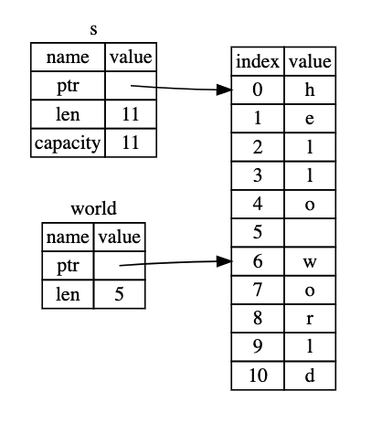

# 字符串与切片

> 问题：如何修改字符串中的某个字符

- 所有字符是Unicode，每个字符4个字节
- 字符串是UTF-8，每个字符1-4个字节可变，可以节省空间
- 字符串类型是`String`，切片类型是`&str`，切片就是对String类型中某一部分的引用
- 字符串常量是`&str`类型，字符串常量会直接编译进可执行文件中，访问快速
- 切片的索引是按照字节粒度切的，不是字符粒度，索引必须落在字符边界，否则编译不通过。因为UTF-8是变长的，切片很容易出错。
- Rust不允许索引字符，即`let h = s1[0]`会报错，因为字符串中字符变长，索引是按字节粒度取数的，取出的结果很可能不是想要的，也因为是变长，索引不再是`O(1)`复杂度。

```rust
let s = String::from("hello world");

let hello = &s[0..5];
let world = &s[6..11];

let slice = &s[0..2]; //右半开区间
let slice = &s[..2]; //等价

let len = s.len();
let slice = &s[4..len]; //第5个到最后一个
let slice = &s[4..];

let slice = &s[0..len]; 
let slice = &s[..]; // 所有

let a = [1, 2, 3, 4, 5];
let slice = &a[1..3]; // 数组切片类型&[i32]
```



字符串操作

```rust
fn main() {
    // 创建一个空String
    let mut s = String::new();
    // 将&str类型的"hello,world"添加到s中
    s.push_str("hello,world");
    // 将字符'!'推入s中
    s.push('!');
    // 最后s的内容是"hello,world!"
    assert_eq!(s,"hello,world!");

    // 从现有的&str切片创建String类型
    let mut s = "hello,world".to_string();
    // 将字符'!'推入s中
    s.push('!');
    // 最后s的内容是"hello,world!"
    assert_eq!(s,"hello,world!");

    // 从现有的&str切片创建String类型
    // String与&str都是UTF8编码，因此支持中文
    let mut s = String::from("你好,世界");
    // 将字符'!'推入s中
    s.push('!');
    // 最后s的内容是"hello,world!"
    assert_eq!(s,"你好,世界!");

    let s1 = String::from("hello,");
    let s2 = String::from("world!");
    // 在下句中，s1的所有权被转移走了，因此后面不能再使用s1
    let s3 = s1 + &s2; // note s1 has been moved here and can no longer be used
    assert_eq!(s3,"hello,world!");
    // 下面的语句如果去掉注释，就会报错
    // println!("{}",s1);

    let s = String::from("hello,world!");
    say_hello(&s);
    say_hello(&s[..]);
    say_hello(s.as_str());

    for c in "中国人".chars() {
        println!("{}", c); // Unicode字符
    }

    for b in "中国人".bytes() {
        println!("{}", b); // 字节
    }

}

fn say_hello(s: &str) {
    println!("{}",s);
}

```