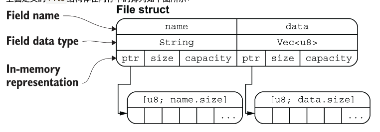

# 元组

元组的使用方法和python里的很像，可以解构，也可以用`.`访问

```rust
let tup: (i32, f64, u8) = (500, 6.4, 1);
let (x, y, z) = tup;
let five_hundred = tup.0;
let six_point_four = tup.1;
let one = tup.2;
println!("{}\t{}\t{}", five_hundred, six_point_four, one)
```

# 结构体

- 必须要将整个结构体都声明为可变的，才能修改其中的字段，Rust不允许单独将某个字段标记为可变

```rust
// 普通结构体
struct User {
    active: bool,
    username: String,
    email: String,
    sign_in_count: u64,
}

// 元组结构体，字段可以没有名字
struct Color(i32, i32, i32);
struct Point(i32, i32, i32);

// 元结构体
struct AlwaysEqual;
let subject = AlwaysEqual;
// 我们不关心为AlwaysEqual的字段数据，只关心它的行为，因此将它声明为元结构体，然后再为它实现某个特征
impl SomeTrait for AlwaysEqual {
    
}

fn main() {
    let user1 = User {
        email: String::from("someone1@example.com"),
        username: String::from("someusername1"),
        active: true,
        sign_in_count: 1,
    };
    let mut user2 = build_user(String::from("someone2@example.com"), String::from("someusername2"));
    user2.email = String::from("test@test.com");

    let user3 = User {
        email: String::from("someone3@example.com"),
        username: String::from("someusername3"), // 如果注释这句话，print_user(&user1)会报错，因为所有权被移走了
        ..user1 // 未申明的字段全部从user1中取，必须在结构体的尾部使用。相当于=，没有实现copy特征的字段所有权被移走了，但是其他字段可以使用。
    };
    print_user(&user1);
    print_user(&user2);
    print_user(&user3);


    let black = Color(0, 0, 0);
    let origin = Point(0, 0, 0);
}

fn print_user(user: &User) {
    println!("{}\t{}\t{}\t{}", user.email, user.username, user.active, user.sign_in_count);
}

fn build_user(email: String, username: String) -> User {
    User {
        email, //与field同名
        username,
        active: true,
        sign_in_count: 1,
    }
}
```

## 结构体内存排列
#TODO

```rust
struct File {
    name: String,
    data: Vec<u8>,
}
```


