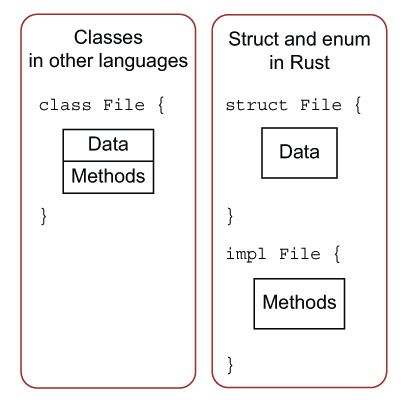

# 方法

方法与函数不同，函数的调用方式是`read(f,buffer)`，方法的调用方式是` f.read(buffer)`，方法与结构体、枚举、特征一起使用。方法对应C++中的成员函数。

## 定义方法

```rust
struct Circle {
    x: f64,
    y: f64,
    radius: f64,
}

impl Circle {
    // new是Circle的关联函数，因为它的第一个参数不是self
    // 这种方法往往用于初始化当前结构体的实例
    fn new(x: f64, y: f64, radius: f64) -> Circle {
        Circle {
            x: x,
            y: y,
            radius: radius,
        }
    }

    fn radius(&self) -> f64 { //方法名字可以字段名字相同
        self.radius
    }
}

impl Circle {
    // Circle的方法，&self表示借用当前的Circle结构体
    fn area(&self) -> f64 {
        std::f64::consts::PI * (self.radius * self.radius)
    }
    fn can_hold(&self, other: &Rectangle) -> bool {
        self.width > other.width && self.height > other.height
    }
}

fn main(){
    let c = Circle::new(1.0, 2.0,3.0);
    println!("{}", c.area()); 
}
```

- Rust中结构体可以方法和数据分离
- 通过impl定义方法
- 可以用多个impl定义多个方法集合
- 没有`&self`是关联函数，如代码中的`new`
- `&self`是`self: &Self`的简写，`Self`是类型，如`Circle`
- 方法遵循所有权准则，`&self`是不可变借用，也可以`&mut self`，`self`
- `c.area()`等价于`(&c).area`，Rust进行了自动引用与解引用。它是这样工作的：当使用 object.something() 调用方法时，Rust 会自动为 object 添加 &、&mut 或 * 以便使 object 与方法签名匹配




```rust
#![allow(unused)]
fn main() {
enum Message {
    Quit,
    Move { x: i32, y: i32 },
    Write(String),
    ChangeColor(i32, i32, i32),
}

impl Message { //枚举类型也可以实现方法
    fn call(&self) {
        // 在这里定义方法体
    }
}

let m = Message::Write(String::from("hello"));
m.call();
}

```